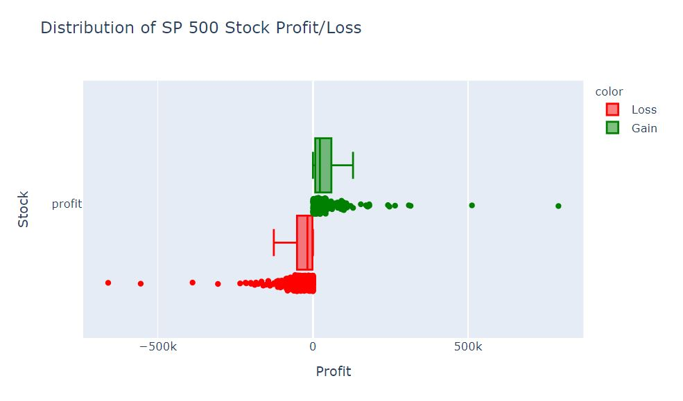
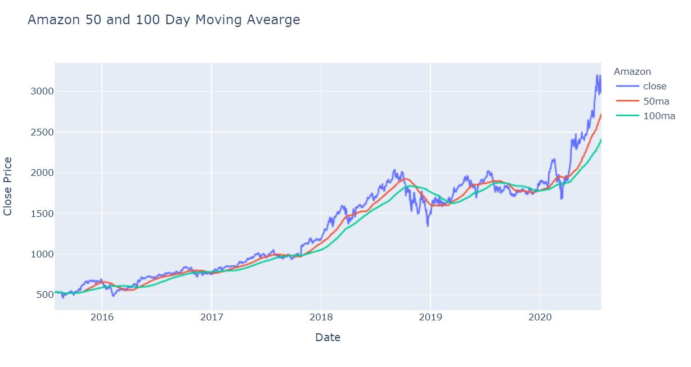
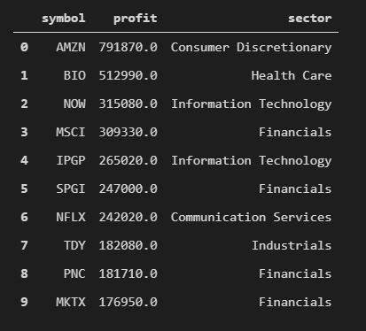
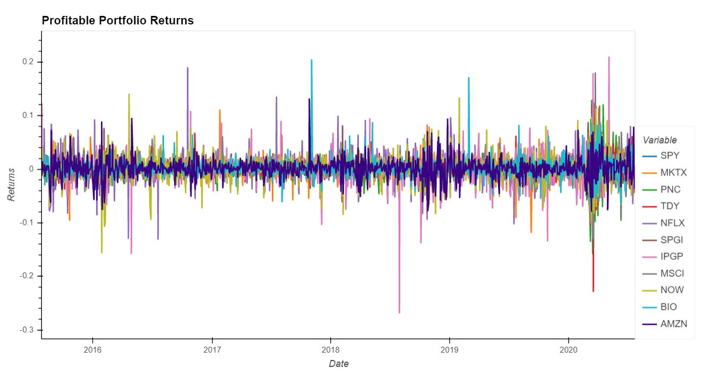
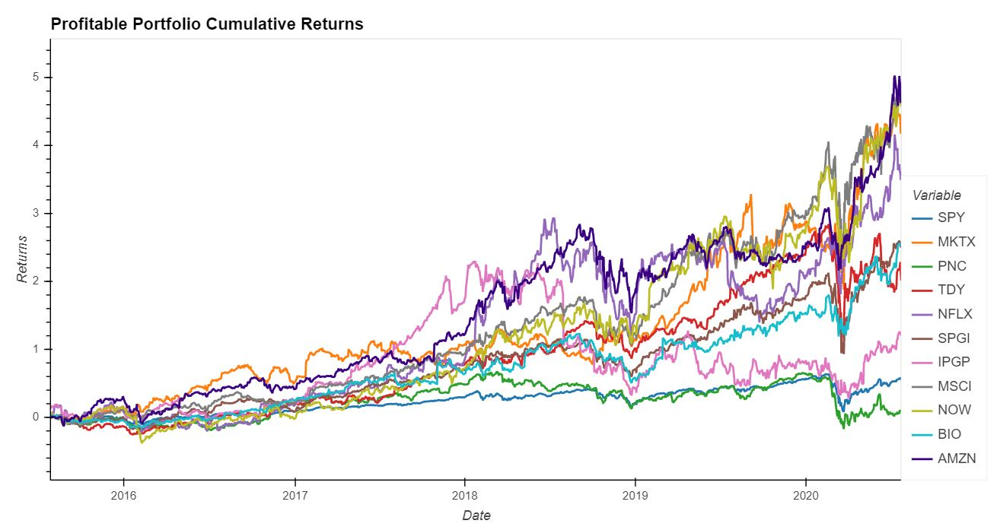
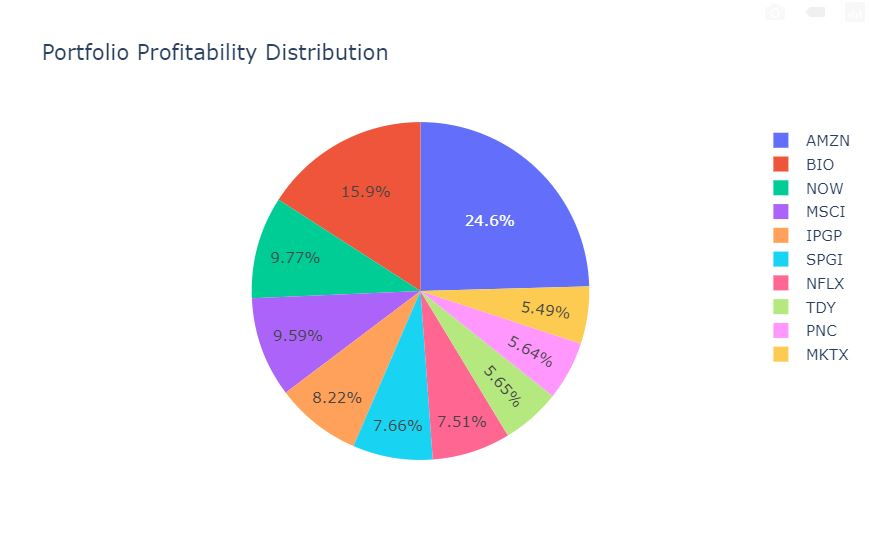
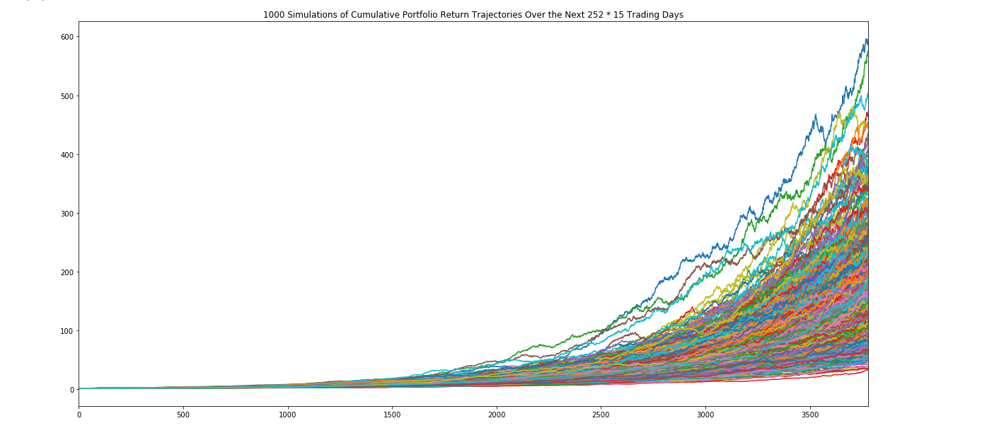
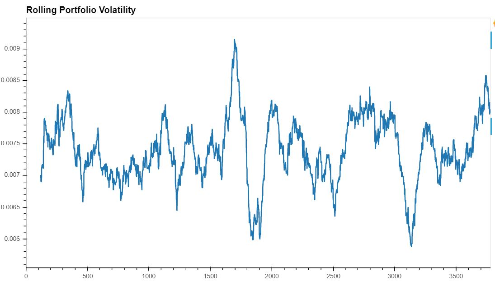

# Building a Medium to Long-Term Profitable Portfolio

*A Python portfolio analysis by Alexandra Dumitras-Geli, Carlos Ituarte, Ian Davies, and Musonda Yamfwa.*

---

## Profitable Portfolio: Creating a Medium to Long Term Investment Strategy

This portfolio development project encompasses an assortment of Python skills obtained througout the Fintech Bootcamp course. Utilizing Python data visulizations tools such as; PyViz, Plotly Express, and HvPlot, partnered with Pandas data cleaning procedures, a financial analysis is conducted to identify opportunities of a well-defined investment algorithm.  Power presentation can be found at [location](https://docs.google.com/presentation/d/1I8NO5Jp4SKLjNEdgbSsNcSCxoTM7Caq1vf-FVTJNYY8/edit?usp=sharing)

### Project Objective

Using the Pandas data reader function, external stock source data, and a well defined algorithm, this project seeks to create a portfolio containing ten stocks generating the highest returns based on an algorithmic and S&P 500 historical trading data evaluation. Furthermore, a Monte Carlo simulation, optimal weight distribution analysis, and a risk analysis were completed to provide an insightful financial analysis to assist potential investors.

### Research Direction

Based on a simple moving average (SMA) crossover trading strategy, the 50 and 100 day windows for the SMA's will establish a profitable medium-to-long term portfolio. Additionally, a financial analysis will respond to the following three questions;

1. Based on the algorithmic trading strategy applied to the S&P 500 stocks, what are the top ten companies returning the highest profit?

2. From the determined portfolio, what are the projected returns at the end of a 15 year period? Was the initial investment worth the financial outcome?

3. Compared to the S&P 500 index, what level of risk does the investor incur?

### Portfolio Performance

The simple moving average trading algorithm is evaluated against the historical stock trading data from the 500 companies listed on the S&P 500 retrieved through the Pandas data reader function connecting to Yahoo finance. The results will generate a portfolio consisting of the ten stocks that have provided investors significant profit over the previous 5 year period. To determine the future success of the portfolio the following financial indicators are used;

1. 15 year Monte Carlo Simulation
2. Optimal Weight Distribution
3. Sharpe Ratio
4. Sortino Ratio

---

## Data Analysis 

We identified potential APIs and libraries that have the ability of retrieving historical stock data that would be used to build our portfolio. 

Our methodology for the data analysis included the following brainstorming questions: (1) ease of retrieving information, (2) consinse information, (3) least amount of missing records and (4) provided us with valuable stock datat to help us filter what we exactly needed for our analysis vs needing to calculate the information. We looked at either the library or API route.

* retrieval of 5 year's worth of data for the 500 stocks in the S&P 500
* removing NULL values 
* sorting data

For our analysis, Yahoo! Finance libary proved to meet all our requirements to build our own dataset. 

Please refer to [Data Builder](portfolio_data_builder.ipynb) notebook. 

### Library for Historical Stock Data via Pandas 

Yahoo! Finance (pip install yahoo-finance) was used to retrieve historical stock data. 

Please refer to [Data Builder](portfolio_data_builder.ipynb) notebook the data clean up details.

### API Exploration 

**Chosen API: API Backtesting section**

[Back Testing API](API_Backtesting.ipynb) is a API / Python framework for inferring viability of trading strategies on historical (past) data. For this exercise we used a SMA crossover strategy with a 50 day window for the fast moving average(ma) and 100 for the slow ma.

Using $10,000 as an initial investment, whenever the fast-moving average crosses the slow ma in an uptrend we go long on the position and whenever it crosses in a downtrend, we close the position and remain out.

We used the output to produce a chart with:
* Plot Equity growth/loss with an interactive chart
* Show peak return %, final return %, Max Drawdown % and Max drawdown duration (days) within the chart 
* Plot price chart with “slow” and “fast” moving averages to show crossovers
* Plot volume

The API also has the capabilities of providing the following information:
* Star and end dates for the simulation
* Duration in days
* The final amount of money at the end of the investment period
* Return on investment in %
* Sharpe Ratio
* Sortino Ratio

Backtesting API is used to analyze a specific stock to produce information and visualizations. The API proved to provide us with added confidence of our own calculations and a way to compare results.  

**Not Chosen: Yahoo finance API**

yfinance.py API showed great potential in its offering historical market data from Yahoo! Finance. Unfortunately, the data retrieved included 'NA's' and blank rows entries (missing values) on stock information resulting skweing our final results. This proposed addition questions if the API had issues or what data was missing. We completed additional research and noted the yfinance API is no longer maintained and concerned that the records were not up-to-date.

**Not Chosen: Pyfolio Library** 

Pyfolio is a Python library used for performance and risk analysis of financial portfolio. We ran into a number of technical issues during our data exploration 

### Data Clean Up

During the pull of the stock prices into the dataframe, each dataframe was checked for Na values and were dropped.  After each stocks profits were calculated, the profit distribution was checked for outliers and how or if the data was skewed.  In the below graph the profits are evenly distributed but the project's focus on the stocks with highest profit and the data skew is accepted.

## Portfolio Summary

### Portfolio Development

Using Python we created trading algorithm focusing on the simple moving average crossover, a portfolio containing ten stocks generating the greatest profits from the S&P 500 index is selected. 

We looked at the moving average (ma) for a 50 day and 100 period. The ma calculations help to provide a 'smoother' price trend of stocks by removing the random short-term price fluctuations. As well as being able to identify the trend direction of stocks for two periods.The ma calculations also use historical data.

Below is the example of using the ma calculations for the Amazon stock (ticket: AMZN) with the results graphed. 

#### Profitable Portfolio Stocks:

#### Portfolio Returns 

The results of the average daily returns and cumulative returns of the profitable portfolio against the S&P 500 (ticket: SPY). As noted in the results of the cumulative returns, it appears 90% of the stocks in the profitable portfolio outperform the S&P 500. The PNC Financial Services Group (ticker: PNC) appears to follow the S&P 500 closely compared to the other stocks within the portfolio. 

---

## Portfolio Performance 

Please refer to [Portfolio Analysis](portfolio_analysis.ipynb) notebook for the sections below. 

### Portfolio Distribution 

Optimal portfolio weight calculation has helped to identify how to distribute the percentage allocation of investment funds. We used the portfolio weights to conduct a financial performance and a Monte Carlo simulation. 

Calculation based on the stock's profit divided by the total sum of profits of the portfolio's stock. 

### Monte Carlo Simulation 

Completed a Monte Carlo simulation to model the probability of different outcomes of the portfolio. Please refer to the portfolio analysis notebook to review.

### Rolling Volatility

90% of the Profitable Portfolio stocks have a higher volatility than the S&P 500 (tickers: MKTX, TDY, NFLX, SPGI, IPGP, MSCI, NOW, BIO, AMZN)

### Sharpe Ratio & Sortino Ratio

The sharpe ratio and sortino ratio were used to understand the portfolio's risk-adjusted return on investment.

The sharpe ratio provides insight on how well an investment is performing and was used to whereas the sortino ratio ratio only factors in the downside. 

Portfolio's annualized Sharpe Ratio: -3.5811413649780466

Portfolio's annualized Sortino Ratio: -6.202279181522641

---

## Limitations 

Based on calculations to determine risk -- the annualized sharpe and sortino ratios provided little insight. For example, the negative either means the risk-free rate is greater than the portfolio’s return, or the portfolio's return is expected to be negative (based on the sharpe ratio). The negative sortinno ratio shows the portfolio underperforming in the year. 

It is important to look at the risk and returns over multiple years to receive a true reflection of the portfolio's risk and return profile. 

In order to provide an accurate risk of the portfolio, risk calculations need to match the investment period. Our calculations only show annualized risk and has the potential to change during the investment period.

## Evaluation 

We used various tools and calculations to support our group's findings in building a profitable stock portfolio that show a strong indication the portfolio will meet desired outcome with strong probability outcomes. 

By including historical data and forecasting measures, the portfolio's returns show the potential outcomes that can be experienced within it's 15 year investment term. 

Based on the calculated returns of the portfolio, our portfolio returns a 336.2% profit versus the S&P 500 which at 55.2%. Therefore, based on the evaluated data, even though the portfolio’s sharpe ratio is 2.8 times higher than the index, the profit gained is higher than the risk incurred, thus proving to be a profitable expenditure worth the investment. 

From our findings what we did not expect was the portfolio’s industry distribution. Our expectation was that our portfolio would contain several technology and consumer distributions stocks. Whereas, the actual result contains only 2 technology stocks, and one consumer discretionary stock, which is amazon. Additionally, the asset distribution in the portfolio is decently balanced, therefore overall mitigating risk factors associated with sector distribution

The backtesting API is a powerful tool that is able to retrieve a number of valuable information to assist us in viewing the stock information within the portfolio. This can be beneficial in reviewing each stock as a piece of the portfolio to compliment our calculations in determining the top ten most profitable stocks. We were not able to use the backtesting API for all the stocks as we'd need to run one stock per calculation. 

Monte Carlo - the simulations show that the portfolio has the ability of achieving the desired result. Note: there is no guaruntee the most expected outcome of the simulation will occur as it ignores movements of the market. The simulation should be viewed as a reference of potential outcomes but ultimately, management of portfolio and adjustments to the portfolio should be made with added information of the market.

## Other Considerations not explored

With an annual review of the stock portfolio, will we see a change in the stocks and weight distribution? 

What are the outlier stocks?

